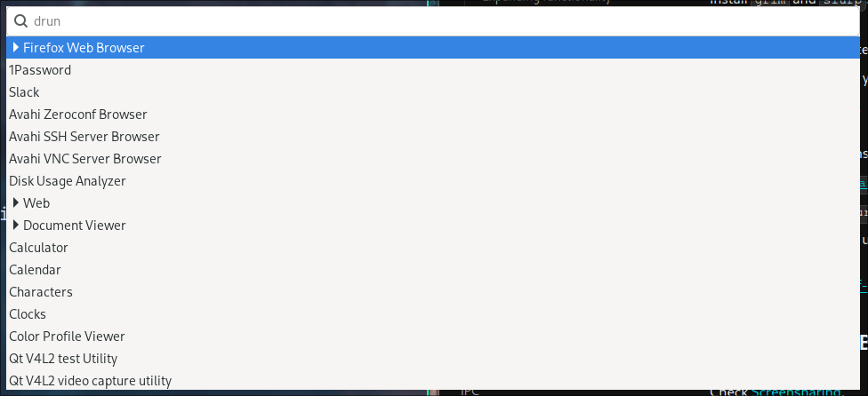
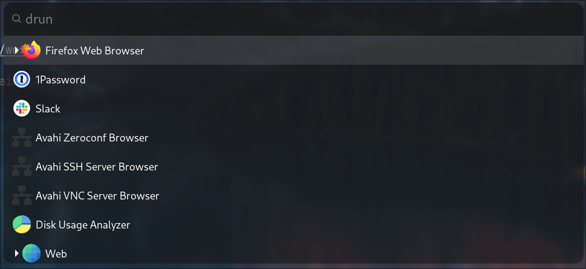

# Awesome Wofi

Welcome to the **Awesome Wofi** project! This repository contains configuration
files for the Wofi launcher/menu program. We aim to provide a collection of
themes and configurations for Wofi, making it easier for users to customize
their Wofi experience. Contributions are welcome!

## Table of Contents

- [About the Project](#about-the-project)
- [Getting Started](#getting-started)
  - [Prerequisites](#prerequisites)
  - [Installation](#installation)
- [Usage](#usage)
- [Contributing](#contributing)
- [License](#license)
- [Screenshots](#screenshots)
- [Acknowledgements](#acknowledgements)

## About the Project

This project aims to create a comprehensive set of configurations for the Wofi
launcher. We encourage the community to contribute new themes and configurations!

## Getting Started

To get a local copy up and running, follow these simple steps.

### Prerequisites

- Wofi: Make sure you have Wofi installed. You can find installation
instructions on the [official Wofi GitHub page](https://hg.sr.ht/~scoopta/wofi).

### Installation

1. Clone the repository:

    ```sh
    git clone https://github.com/calthejuggler/awesome-wofi.git
    ```

2. Navigate to the project directory:

    ```sh
    cd awesome-wofi
    ```

3. Copy the desired theme to your Wofi configuration directory:

    ```sh
    cp themes/blank/* ~/.config/wofi/
    ```

## Usage

After copying the configuration file, you can launch Wofi to see the new theme
in action:

```sh
wofi --show drun -I
```

## Contributing

We welcome contributions from the community! To contribute:

1. Fork the Project.
2. Create your Feature Branch (`git checkout -b feature/AmazingTheme`).
3. Copy the blank theme to a new folder
    (`mkdir themes/AmazingTheme && cp themes/blank/* themes/AmazingTheme/`).
4. Edit the theme files to your liking.
5. Commit your Changes (`git commit -m 'feat:add AmazingTheme'`).
6. Push to the Branch (`git push origin feature/AmazingTheme`).
7. Open a Pull Request.

When you add a new theme, please include a screenshot of the theme in the
`screenshots` directory - please name the screenshot with the same name as your
theme for consistency.

## License

Distributed under the MIT License. See `LICENSE` for more information.

## Screenshots

### Blank Theme



### Raycast [WIP]



## Acknowledgements

- [Wofi](https://github.com/adi1090x/wofi) - The launcher/menu program we are
creating themes for.

Thank you for checking out our project! We look forward to your contributions.

---

Feel free to customize this README further based on the specific details and
needs of your project.
